# How to run VirtualBox with Hyper-V acceleration on Windows 10?

The "Windows Hypervisor Platform" becomes available from version 1803 and this one allows VirtualBox to be based on the native Hyper-V to work next to it.

If you have Windows 10 with version no less than v1803, then VirtualBox can be used with Hyper-V acceleration.

## 1. Preparaion
1. check Windows 10 version no less than v1803
2. Install all Hyper-V features on Windows 10 as highlighted

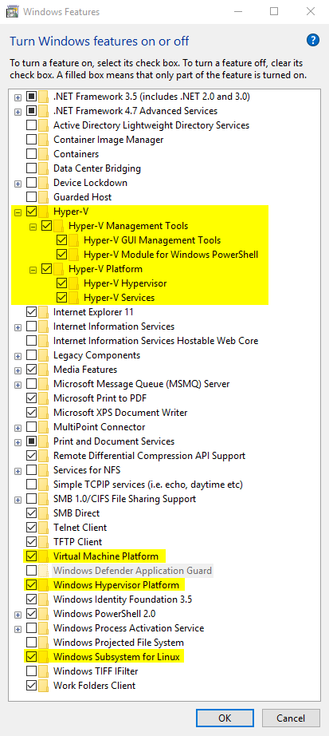

The last feature *Windows Subsystem for Linux* is NOT needed.

3. The Hyper-V services look like

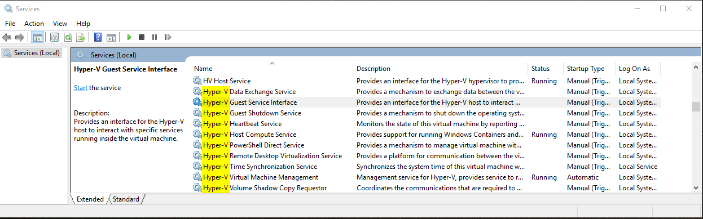

## 2. Install Ubuntu on VirtualBox with Hyper-V acceleration
1. Stop Hyper-V at boot, run *Command Prompt* as Administrator,

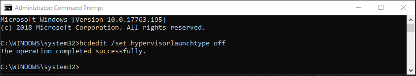

When you see the output successfull, reboot Windows 10.

2. After Windows 10 booted, check the *System Information*

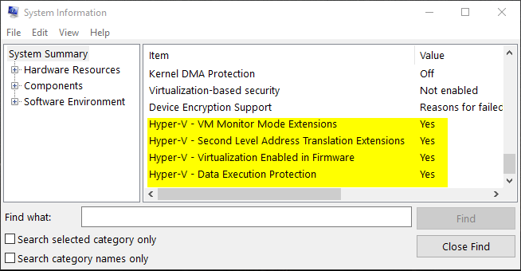

All four Hyper-V items are all Yes.

3. Configure VirtualBox virtual machine using Hyper-V acceleration

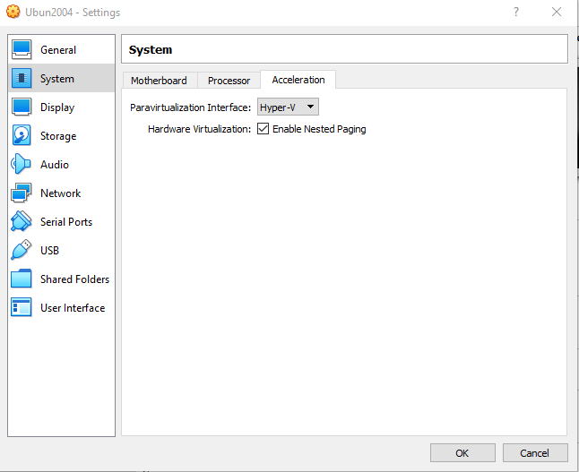

The Ubuntu VM settings summary:

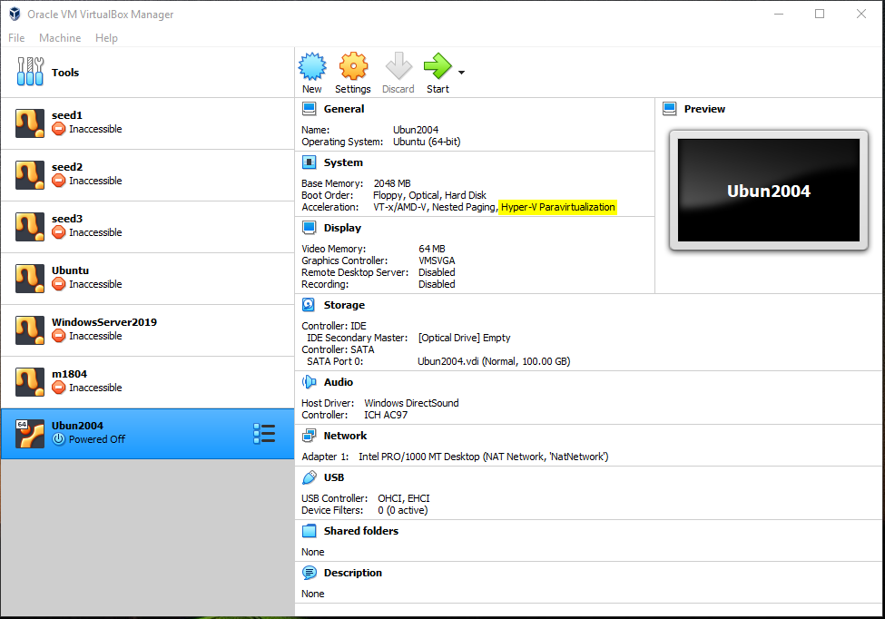

*Now follow typical process to Install Ubuntu using VirtualBox.*

4. If you see the following error trying running the Ubuntu VM, it means Hyper-V is running, which should be stopped to run VirtualBox VMs.

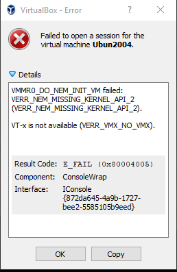

## 3. Install Ubuntu with Hyper-V manager
1. Start Hyper-V at boot, run *Command Prompt* as Administrator,

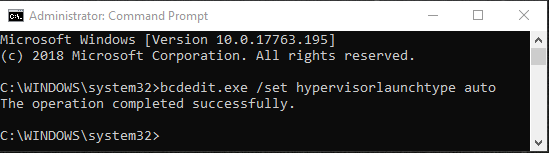

When you see the output successfull, reboot Windows 10.

2. After Windows 10 booted, check the *System Information*

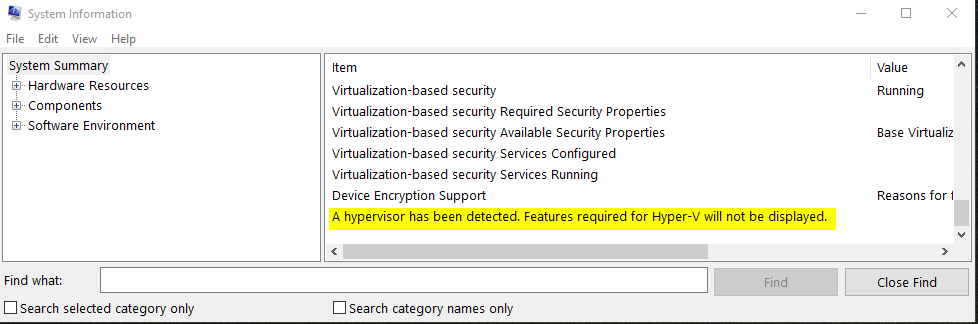

All four Hyper-V items are gone.

3. Use Hyper-V manager create a bare-bone VM,

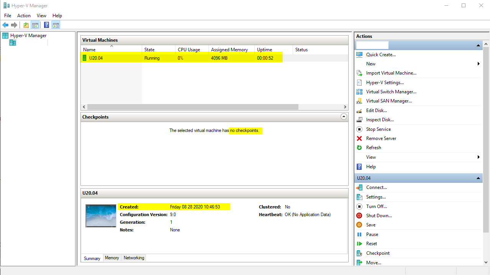

*Checkpoint is disabled to save disk space.*

Configure the VM as

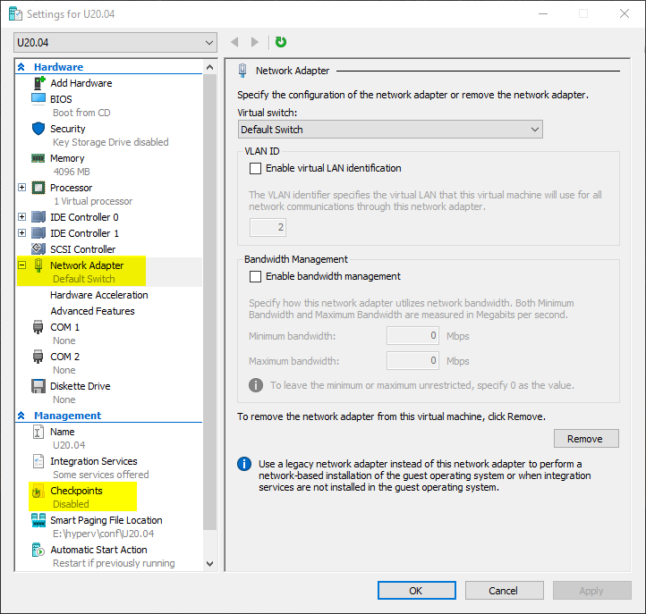

*Now follow typical process to Install Ubuntu  using Hyper-V.*

Here is Ubuntu 20.04 LTS running in Hyper-V

1. If you see the following error, it means Hyper-V is NOT running, which should be started to run Hyper-V VMs.

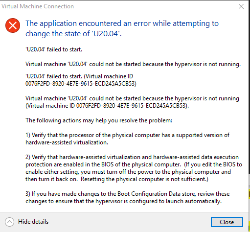

## References
* [Use VirtualBox and Hyper-V simultaneously](https://us.informatiweb.net/tutorials/it/virtualization/virtualbox-use-virtualbox-and-hyper-v-at-the-same-time.html)
* [Choose between VirtualBox or Hyper-V at startup](https://us.informatiweb.net/tutorials/it/virtualization/hyper-v-coexistence-with-virtualbox-or-vmware-workstation.html)
* [Hash sum mismatch error while upgrading](https://superuser.com/questions/1557457/hash-sum-mismatch-error-while-upgrading)
* [Hyper-v: shut down a virtual machine that is not responding](https://rdr-it.com/en/troubleshooting/hyper-v-shut-down-a-virtual-machine-that-is-not-responding/)
* [Hyper-V VM Stuck in the “Stopping/Starting” State](http://woshub.com/how-to-stop-a-hung-virtual-machine-on-hyper-v-2016/)
* [Windows 10: Changing Hyper-V support at boot time](https://d3v.one/windows-10-changing-hyper-v-support-at-boot-time/)
* [Enabling Hypervisor to auto start in the Boot Configuration Database (BCD)](https://www.interfacett.com/blogs/enabling-hypervisor-auto-start-boot-configuration-database-bcd/)
* [Configure virtual local area networks for Hyper-V](https://docs.microsoft.com/en-us/windows-server/virtualization/hyper-v/deploy/configure-virtual-local-areal-networks-for-hyper-v)
* [Hyper-V Virtual Switch](https://docs.microsoft.com/en-us/windows-server/virtualization/hyper-v-virtual-switch/hyper-v-virtual-switch)